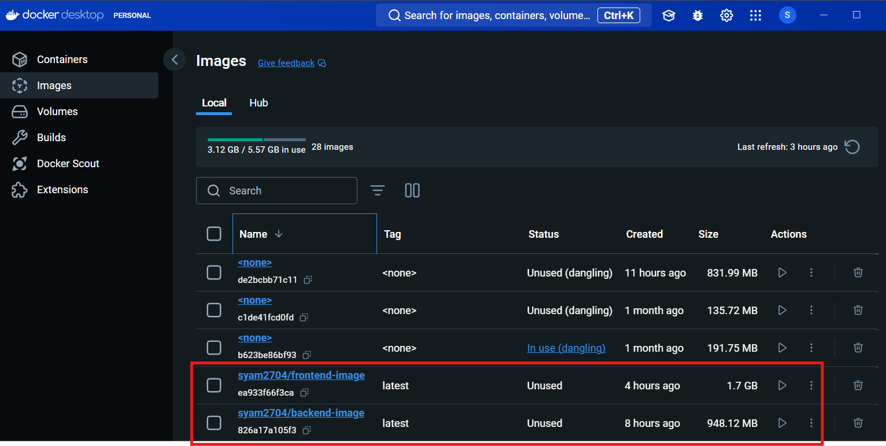

# Graded Assignment on Container Orchestration

## Objective
This demonstrates how to create Kubernetes deployment files and a HELM chart for a MERN (MongoDB, Express.js, React.js, Node.js) based application

---

## Prerequisites
Make sure you have the following installed on your system:
- Docker: For containerization.
- Node.js: To run the application locally. 
- Kubernetes (Minikube): For local cluster deployment. 
- kubectl: To manage Kubernetes.
- Helm: For managing Kubernetes resources. 
- Jenkins: For CI/CD automation. 
- Git: To clone repositories. 

## Instructions

### 1. Code setup
1. This has 2 components - Frontend & Backend. Fork the repositories from 
   - Fork the repository https://github.com/UnpredictablePrashant/learnerReportCS_frontend to https://github.com/SyamalaKadmi/learnerReportCS_frontend.git 
   - Fork the backend repository https://github.com/UnpredictablePrashant/learnerReportCS_backend to https://github.com/SyamalaKadmi/learnerReportCS_backend.git

2. Clone the repositories using
   ```bash
      git clone https://github.com/SyamalaKadmi/learnerReportCS_frontend.git 
      git clone https://github.com/SyamalaKadmi/learnerReportCS_backend.git 
   ```

---

### 2. Build & Push docker images
1. Build and Push Frontend Image:
   ```bash
      cd ../learnerReportCS_frontend
      docker build -t syam2704/frontend-image:latest .
      docker push syam2704/frontend-image:latest
   ```
2. Build and Push Backend Image: 
   ```bash
      cd ../learnerReportCS_backend
      docker build -t syam2704/backend-image:latest .
      docker push syam2704/backend-image:latest
   ```
Docker images:


---

### 3. Creating Kubernetes Deployment Files
In Kubernetes, we use YAML files to define how our application should run
1. Frontend:
   - Create a k8s folder and create a file named frontend-configmap.yaml [frontend-configmap.yaml](). This stores environment variables for the frontend
   - Create frontend-deployment.yaml [frontend-deployment.yaml](k8s/frontend-deployment.yaml). This defines how many frontend containers to run and which image to use. \
   - Create frontend-service.yaml [frontend-service.yaml](k8s/frontend-service.yaml).  This exposes the frontend to the internet. 
   - Apply the configurations to Kubernetes
   ```bash
      kubectl apply -f frontend-configmap.yaml
      kubectl apply -f frontend-deployment.yaml
      kubectl apply -f frontend-service.yaml
   ```
   - Check the status of the deployment
   ```bash
      kubectl get pods
      kubectl get services
   ```
   
2. Backend:
   - ConfigMap: Store non-sensitive environment variables for the backend. [backend-configmap.yaml](k8s/backend-configmap.yaml)
   - Secret: Store sensitive information (like MongoDB credentials).[backend-secret.yaml](k8s/backend-secret.yaml)
   - Deployment: Define how many instances of the Node.js backend to run and from which Docker image.[backend-deployment.yaml](k8s/backend-deployment.yaml)
   - Service: Expose the backend so the frontend can communicate with it.[backend-service.yaml](k8s/backend-service.yaml)
   - Apply the configurations to Kubernetes
   ```bash
      kubectl apply -f backend-configmap.yaml
      kubectl apply -f backend-deployment.yaml
      kubectl apply -f backend-service.yaml
      kubectl apply -f backend-secret.yaml
   ```
3. MongoDB:
   - Secret: Store sensitive information (like MongoDB credentials).[mongo-secret.yaml](k8s/mongo-secret.yaml)
   - Deployment: Define how many instances of the Node.js backend to run and from which Docker image.[mongo-deployment.yaml](k8s/mongo-deployment.yaml)
   - Apply the configurations to Kubernetes
   ```bash
      kubectl apply -f mongo-deployment.yaml
      kubectl apply -f mongo-secret.yaml
   ```

---

### 4. HELM Chart
1. Create a Helm Chart
   ```bash
      helm create mern-stack
   ```
   This creates a folder called mern-stack
2. Copy the created yaml files for frontend, backend and MongoDB into mern-stack/templates directory
3. Edit values.yaml to store the MERN application data
   ```bash
      # Global Settings
      replicaCount: 2

      # Frontend Settings
      frontend:
         image: "your-docker-username/frontend-image:latest"
         containerPort: 3000
         servicePort: 3000
         nodePort: 32000

      # Backend Settings
      backend:
         image: "your-docker-username/backend-image:latest"
         containerPort: 5000
         servicePort: 5000
         environment:
            MONGO_HOST: "mongodb-service"
            MONGO_PORT: "27017"

      # MongoDB Settings
      mongodb:
         image: "mongo:6.0"
         containerPort: 27017
         storage: 5Gi
         secret:
            username: "your-username"
            password: "your-password"

   ```
4. Package & Install Helm Chart
   ```bash
         cd k8s
         helm package .
         helm install mern-app ./mern-stack-0.1.0.tgz
   ```
5. Verify the deployment
   ```bash
      kubectl get pods
      kubectl get svc
   ```
   - 
6. Expose the frontend service to open the application in your browser
   ```bash
      minikube service frontend-service
   ```
   - 